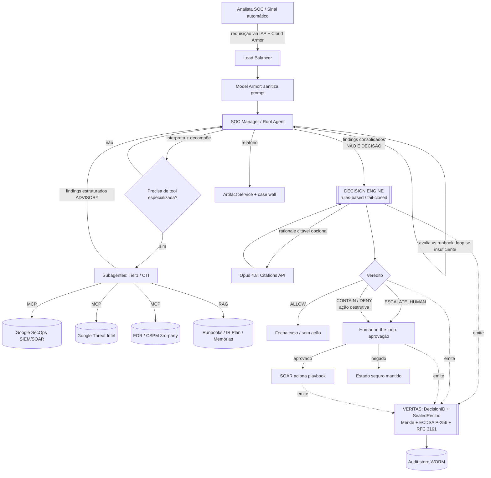

# Arquitetura — FoundLab SecOps Orchestration Layer

> **Status:** Blueprint v0.1 — DRAFT para ratificação de Alex no Decision Gate.
> **Invariante não-negociável:** decisões de bloqueio/contenção são sempre rule-based e fail-closed. O LLM (Gemini ou Opus 4.8) entra **apenas** como camada advisory/explicativa. **Nunca** no caminho crítico de decisão.
> **Contrato de Evidência:** cada afirmação abaixo é classificada como `[EVID]` Evidenciada, `[INFER]` Inferida, `[HIP]` Hipótese ou `[N/A]` Não avaliada. Nada marcado `[HIP]` vai para produção sem validação humana.

-----

## 1. Escopo e premissas

Este documento descreve a camada de orquestração SecOps da FoundLab: um sistema multi-agente que coordena triagem e investigação de incidentes através de SIEM, threat intel, CSPM e EDR — com o diferencial de que **o caminho de decisão crítica permanece determinístico e auditável**, não delegado a inferência probabilística.

`[EVID]` O esqueleto de referência é a arquitetura “Agentic SOC” do Google Cloud Architecture Center (autores: Security Specialist e SecOps AI Engineer da Google), baseada em ADK, Vertex AI Agent Engine / Cloud Run, Gemini, Google SecOps (SIEM+SOAR), Google Threat Intelligence e Model Armor, com servidores MCP Google-gerenciados.

`[INFER]` O delta FoundLab sobre esse esqueleto: (a) inserção de um **Decision Engine determinístico** entre as conclusões do LLM e qualquer ação de contenção; (b) **Veritas Protocol** capturando cadeia de evidência imutável de cada decisão; (c) **Opus 4.8 como segundo modelo** especializado em rationale citável para decisões de alto risco, em padrão dual-model com Gemini.

`[HIP]` A adoção de Opus 4.8 no caminho advisory depende de piloto comparativo contra Gemini (ver `entender.md`, seção “Decisão de modelo”). Este blueprint assume que o piloto será conduzido, não que o resultado já está decidido.

-----

## 2. Princípios de arquitetura

1. **Fail-closed por padrão.** Na ausência de decisão explícita do Decision Engine, o sistema nega/contém — nunca libera. Timeout, erro de modelo, ou indisponibilidade de tool resultam em estado seguro, não em bypass.
1. **LLM advisory-only.** Modelos geram enriquecimento, correlação, hipóteses e rationale. Não acionam SOAR, não fecham caso, não aplicam contenção. Quem aciona: Decision Engine (regras) + aprovação humana onde a política exige.
1. **Zero-persistence na inferência.** Payloads sensíveis não persistem no caminho de inferência além do necessário para a resposta; o que persiste é a **evidência** (DecisionID, hashes, recibo selado), não o dado bruto.
1. **Toda decisão é um evento auditável.** Cada veredito do Decision Engine emite um registro Veritas com cadeia criptográfica verificável.
1. **Human-in-the-loop em ação destrutiva.** Isolamento de endpoint, revogação de credencial, bloqueio de conta — sempre exigem ratificação humana explícita.
1. **Defesa contra prompt injection.** Model Armor + Constitutional AI (no caso Opus) na borda de toda interação com modelo.

-----

## 3. Componentes (fullstack)

### 3.1 Borda / Ingress

`[EVID]` Padrão GCP-native do blueprint de referência:

- **Cloud Load Balancing** — Application Load Balancer roteando requisições.
- **Google Cloud Armor** — WAF + proteção DDoS na borda.
- **Identity-Aware Proxy (IAP)** — modelo zero-trust, verificação de identidade do analista.
- **Model Armor** — inspeção/sanitização de prompts, tool calls e respostas (anti prompt-injection, anti vazamento de dado sensível).

### 3.2 Camada de orquestração (agentes)

`[EVID]` Padrão hierarchical task decomposition (coordinator pattern):

- **Root agent / SOC Manager** — recebe a requisição, interpreta, decompõe em subtarefas, delega a subagentes especializados, avalia findings contra runbook, sintetiza relatório.
- **Subagentes especializados** — ex.: **Tier 1 Analyst** (detalhe de alerta, ativos afetados, contexto de usuário via Google SecOps); **CTI Researcher** (correlação de IOCs com TTPs de threat actors via Google Threat Intelligence).

`[INFER]` **Composição do agente:** ADK (Agent Development Kit) deployado como serviço Cloud Run serverless, ou Vertex AI Agent Engine. Recomendação FoundLab: começar em **Cloud Run** (consistente com o stack REX Guard atual; mais controle sobre o caminho de decisão).

### 3.3 Decision Engine — **o coração FoundLab (delta sobre o Google)**

`[HIP]` Componente que **não existe** no blueprint de referência do Google e que materializa o invariante fail-closed:

- Recebe findings estruturados dos agentes (advisory).
- Aplica **regras determinísticas** (policy-as-code) sobre os findings.
- Emite veredito: `ALLOW` / `CONTAIN` / `ESCALATE_HUMAN` / `DENY`.
- Em qualquer ambiguidade, erro ou timeout → veredito seguro (`CONTAIN`/`ESCALATE_HUMAN`).
- **Nenhum output de LLM passa direto para ação.** O LLM informa o Decision Engine; o Decision Engine decide.

`[INFER]` Implementação sugerida: serviço Cloud Run (FastAPI/Node, consistente com REX Guard) com motor de regras versionado e `policy_snapshot_hash` por avaliação — mesmo padrão já usado no REX Guard.

### 3.4 Grounding / RAG

`[EVID]` **RAG knowledge database** — fonte de grounding: incident response plans, AI runbooks (workflows prescritivos como Agent Skills), memórias de incidentes anteriores.
`[EVID]` **Vertex AI Memory Bank** — memórias de longo prazo geradas a partir das investigações.
`[EVID]` **Artifact Service** — relatórios e evidências existentes.

### 3.5 Acesso a ferramentas (MCP)

`[EVID]` Padronização via Model Context Protocol:

- **Google SecOps MCP server** (Google-gerenciado) — acesso a SIEM + SOAR (eventos, entidades, logs, casos).
- **Google Threat Intelligence MCP server** — correlação com dados de adversários globais.
- **Third-party MCP servers** — conectores para EDR/CSPM de terceiros.

`[INFER]` FoundLab pode expor seus próprios sistemas internos (Spanner, cadeias de evidência Veritas) como **MCP server permissionado**, com OAuth e controle de acesso granular — padrão mais limpo que conectores ad-hoc.

### 3.6 Camada de inferência (dual-model)

`[HIP]` **Gemini** (default) — interpretação, decomposição, síntese de alto volume, grounding nativo.
`[HIP]` **Opus 4.8** (`claude-opus-4-8` no Vertex AI) — rationale citável para decisões de alto risco, usando **Citations API** para fundamentar explicações em texto-fonte regulatório/runbook. `[EVID]` Disponível no Vertex AI; `[EVID]` Citations API documentada no Vertex; `[HIP]` suporte a Structured Outputs no Vertex para o ID 4.8 ainda **a verificar** — fallback para strict tool use.

### 3.7 Evidência / Auditoria (Veritas — delta FoundLab)

`[INFER]` Cada veredito do Decision Engine emite registro Veritas: `DecisionID`, `SealedRecibo`, `policy_snapshot_hash`, cadeia Merkle, assinatura ECDSA P-256 via HSM, timestamp RFC 3161 (TSA). Padrão idêntico ao já operante no REX Guard.

-----

## 4. Fluxo end-to-end

> Versão narrativa em `fluxo-e2e.md`. Diagrama abaixo.

**Ponto crítico do diagrama:** a seta `D → K` carrega *findings*, não *decisão*. O LLM nunca tem aresta direta para `P (SOAR aciona)`. Toda ação destrutiva passa por `O (human-in-the-loop)`. Todo nó de decisão emite Veritas.

-----

## 5. Mapa NIST (alto nível)

> Escopo: alto nível, para orientar controles. **Não é** uma asserção de conformidade. `[INFER]` em todo o mapa — mapeamentos exatos exigem validação de GRC. Revisões exatas dos SPs devem ser confirmadas na fonte primária (csrc.nist.gov).

### 5.1 NIST CSF 2.0 — seis funções

`[EVID]` O CSF 2.0 (2024) define seis funções: GOVERN, IDENTIFY, PROTECT, DETECT, RESPOND, RECOVER.

|Função CSF 2.0   |Onde aparece nesta arquitetura                                                                                                 |
|-----------------|-------------------------------------------------------------------------------------------------------------------------------|
|**GOVERN (GV)**  |Decision Engine como policy-as-code versionada; `policy_snapshot_hash`; invariante fail-closed declarado; Decision Gate humano.|
|**IDENTIFY (ID)**|RAG com IR plans/runbooks; inventário de ativos via SIEM; CTI mapeando TTPs.                                                   |
|**PROTECT (PR)** |IAP (zero-trust), Cloud Armor (WAF), Model Armor, mTLS inter-serviço, IAM granular.                                            |
|**DETECT (DE)**  |Google SecOps SIEM, correlação de alertas, enriquecimento por agentes.                                                         |
|**RESPOND (RS)** |Decision Engine + human-in-the-loop + SOAR playbooks; relatório de investigação.                                               |
|**RECOVER (RC)** |Runbooks de recuperação; trilha Veritas para post-mortem e lições aprendidas.                                                  |

### 5.2 NIST AI RMF 1.0 — a camada de IA

`[EVID]` O AI RMF 1.0 (2023) define quatro funções: GOVERN, MAP, MEASURE, MANAGE.

|Função AI RMF|Aplicação                                                                                               |
|-------------|--------------------------------------------------------------------------------------------------------|
|**GOVERN**   |Invariante advisory-only; Constitutional AI; Model Armor; dual-model com fallback.                      |
|**MAP**      |Contexto de uso = SecOps de alto risco; LLM classificado como advisory, fora do caminho crítico.        |
|**MEASURE**  |Métricas do piloto: precisão de citação, taxa de alucinação, qualidade de rationale (ver `entender.md`).|
|**MANAGE**   |Versionamento de modelo pinado; gate de mudança; rollback; logging de request/response no SIEM.         |

### 5.3 Famílias de controle SP 800-53 (alto nível)

`[INFER]` Famílias mais relevantes para este escopo SecOps: **AU** (Audit & Accountability — Veritas), **AC** (Access Control — IAM/IAP), **IR** (Incident Response — todo o fluxo), **SI** (System & Information Integrity — Model Armor, validação), **CA** (Assessment/Monitoring), **RA** (Risk Assessment — CTI/scoring), **SC** (System & Comms Protection — mTLS, cripto).

`[HIP]` SP 800-61 (Computer Security Incident Handling) é a referência para o playbook de IR; a revisão vigente foi recentemente realinhada ao CSF 2.0 — **confirmar a revisão exata** antes de citar formalmente.

-----

## 6. Limites e ressalvas de conformidade

- `[EVID]` **PCI-DSS:** o provedor do modelo Anthropic não é certificado PCI-DSS (não é processadora de pagamento). **Zero dado de cartão** no caminho de inferência. Mesma disciplina vale para qualquer LLM.
- `[HIP]` **Residência de dado BR:** endpoints de residência multi-região documentados para Claude no Vertex cobrem US/EU; **não há** garantia documentada de in-region Brasil. Confirmar com Google Cloud antes de rotear dado bancário regulado.
- `[INFER]` **LGPD/GDPR:** zero-persistence na inferência + SCCs cobrem parte; DPO precisa ratificar o caminho de dado.
- `[EVID]` Model details (pricing, model strings, paridade de funcionalidade no Vertex) mudam rápido — verificar em docs.claude.com / Vertex Model Garden na implementação.

-----

## 7. O que falta decidir (gates abertos)

1. `[HIP]` Cloud Run vs Vertex AI Agent Engine para o runtime dos agentes.
1. `[HIP]` Resultado do piloto dual-model (Opus 4.8 vs Gemini no advisory de alto risco).
1. `[HIP]` Política de assinatura de thinking/rationale no SealedRecibo (decisão arquitetural pendente, herdada da evolução RAG).
1. `[HIP]` Escopo de scan pós-inferência (Gate 6) sobre output de modelo antes de chegar ao Decision Engine.

> Nenhum item acima deve ser inventado por implementador. Ratificação de Alex no Decision Gate é obrigatória.