# REX Guard Marketplace MVP — GCPPoC Extraction Plan

**Status:** Draft técnico para GitHub  
**Owner técnico:** Raphael Oliveira Bomfim  
**Arquitetura:** FoundLab / Alex Bolson  
**Modo de entrega recomendado:** Google Cloud Marketplace **Private Offer / Managed SaaS MVP** primeiro; Integrated SaaS completo depois.  
**Fonte primária:** GCPPoC atual do REX Guard + portfólio FoundLab GCP Marketplace v1.0.  
**Classificação:** CONFIDENCIAL — uso interno FoundLab. Não publicar em repositório público.

---

## 0. TL;DR

Não transformar o REX Guard em "produto público self-service" no primeiro corte.

Fazer primeiro:

> **REX Guard Marketplace MVP**  
> Private Offer via Google Cloud Marketplace, operado pela FoundLab no backend atual do **GCPPoC**, com ativação semi-automatizada de tenant, plano mensal fixo e decisão auditável como métrica interna.

Depois industrializar para:

> **REX Guard Marketplace Edition**  
> Integrated SaaS com Partner Procurement API, Pub/Sub entitlement lifecycle, Tenant Registry, Usage Metering, Service Control e onboarding automatizado.

O core já existe. O que falta é a camada de **commerce/runtime isolation** do Marketplace.

---

## 1. Evidência de prontidão atual

### 1.1 CI atual observado

Log de referência do GCPPoC:

```txt
npm run test:ci
> jest --coverage --runInBand

Test Suites: 35 passed, 35 total
Tests:       20 todo, 613 passed, 633 total
Coverage:
- Statements: 98.94%
- Branches:   92.15%
- Functions:  99.53%
- Lines:      99.09%
Time: 40.332s
```

### 1.2 Ambiente atual observado no GitHub Actions / GCPPoC

```bash
GCP_REGION=southamerica-east1
GCP_PROJECT=foundlab-ati
AR_REGISTRY=southamerica-east1-docker.pkg.dev/foundlab-ati/rex-guard
IMAGE_NAME=rex-guard
CLOUD_RUN_SERVICE=rex-guard
FORCE_JAVASCRIPT_ACTIONS_TO_NODE24=true
```

### 1.3 Repositório de origem

```bash
REPO=github.com/FoundLab-PoweredByGoogleCloud/rex-guard
CURRENT_BRANCH=feature/bradesco-poc
TARGET_BRANCH=feat/marketplace-mvp
```

> Nota: se o branch real mudou, puxar do branch que contém o CI acima. Não criar outro monstro escondido no armário. Já basta um.

---

## 2. Decisão de arquitetura

### 2.1 Mini-ADR

#### Contexto

REX Guard hoje é middleware criptográfico para decisões GenAI:

- intercepta chamada para Vertex AI / Gemini;
- aplica política;
- opera fail-closed;
- assina decisão via Cloud KMS;
- registra evidência auditável;
- retorna resposta com `DecisionID` / recibo.

O portfólio FoundLab já classifica REX Gemini Guard como produto **SaaS Puro**, com alta prontidão e foco em AI Governance.

#### Problema

O core técnico está forte, mas Marketplace exige uma camada que o GCPPoC provavelmente ainda não tem completa:

- lifecycle de compra;
- entitlement;
- tenant;
- plano;
- cobrança;
- suspensão/cancelamento;
- reconciliação de uso;
- isolamento por cliente;
- onboarding sem humano, ou pelo menos semi-automatizado no MVP.

#### Opções

| Opção | Vende rápido? | Escala? | Risco | Decisão |
|---|---:|---:|---:|---|
| Public SaaS self-service completo agora | Não | Sim | Alto | Não no v1 |
| Private Offer usando GCPPoC | Sim | Médio | Médio | **Sim, v1** |
| Contrato direto fora Marketplace | Sim | Baixo | Baixo | Só fallback |
| Kubernetes/Terraform Marketplace app | Médio | Médio | Alto | Não agora |
| Integrated SaaS completo | Médio | Alto | Médio | v2 |

#### Decisão

Construir primeiro:

```txt
REX Guard Marketplace MVP
= Private Offer
+ FoundLab-operated SaaS
+ GCPPoC backend
+ Tenant Registry mínimo
+ plano mensal fixo
+ usage interno para relatório/reconciliação
```

#### Consequência

Vende primeiro. Automatiza depois.

---

## 3. Arquitetura alvo em fases

## 3.1 Fase 1 — Marketplace MVP usando GCPPoC

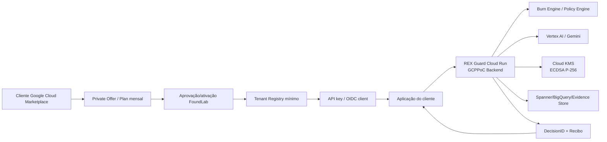

### Características

- Compra via Marketplace, ativação inicial semi-manual.
- REX roda no projeto atual `foundlab-ati`.
- Cliente recebe endpoint e credencial.
- Cobrança inicial: mensal/fixa por Private Offer.
- `billable_decision` medido internamente, mas não necessariamente reportado para Google no dia 1.
- Usage-based billing fica para v2.

---

## 3.2 Fase 2 — Integrated SaaS Marketplace Edition

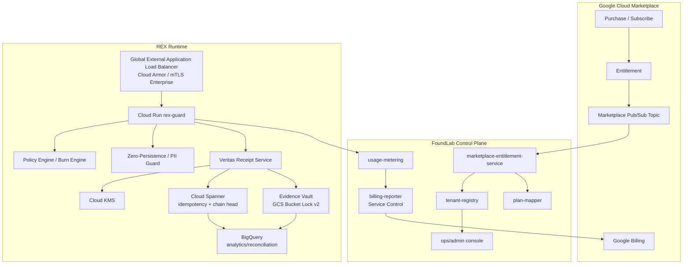

---

## 4. Fluxos principais

## 4.1 Fluxo de compra / ativação — MVP Private Offer

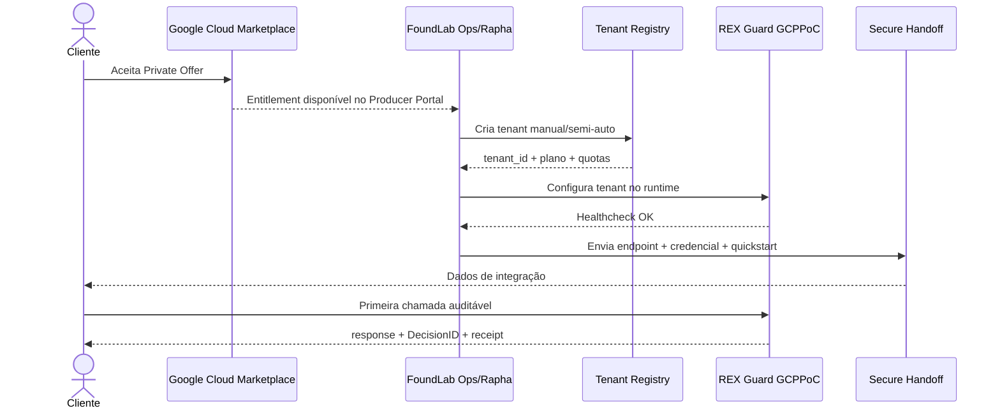

### Critério de aceite MVP

```txt
Marketplace purchase
→ tenant criado
→ cliente recebe credencial
→ chamada /v1/gemini:generateContent funciona
→ REX retorna DecisionID
→ evidência auditável é registrada
→ usage interno aparece no relatório
```

---

## 4.2 Fluxo de entitlement — v2 Integrated SaaS

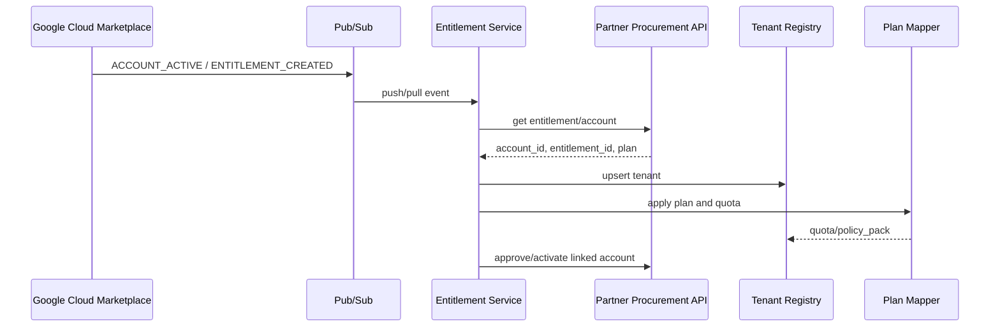

---

## 4.3 Fluxo de decisão auditável

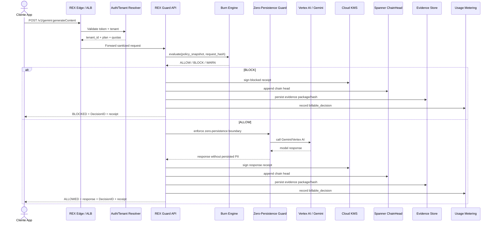

---

## 4.4 Fluxo de usage / billing — v2

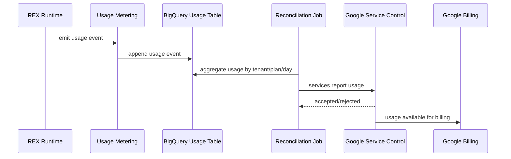

---

## 5. GCPPoC: mapa de coisas para puxar/copiar

> Objetivo: Rafa conseguir abrir o repo atual e saber exatamente o que reaproveitar.

### 5.1 Branch de trabalho

```bash
git clone git@github.com:FoundLab-PoweredByGoogleCloud/rex-guard.git
cd rex-guard
git checkout feature/bradesco-poc
git pull
git checkout -b feat/marketplace-mvp
```

### 5.2 Módulos atuais a preservar

Com base no CI/coverage atual:

| Área | Arquivo / teste atual | Ação |
|---|---|---|
| API HTTP | `src/routes.ts` | preservar, extrair auth/tenant resolver |
| Auth | `src/middleware/firebase-auth.ts` | adaptar para tenant-aware auth |
| Core inference | `src/services/inference-engine.ts` | preservar como core runtime |
| Policy | `src/services/burn-engine.ts` | preservar como Policy Engine |
| Policy orchestration | `tests/unit/burn-engine-orchestrator.spec.ts` | localizar fonte correspondente e mover para policy layer |
| Policy state | `src/services/burn-engine-state.ts` | preservar |
| Policy rules | `src/services/burn-engine-policy.ts` | preservar |
| Feature flags | `src/services/burn-engine-features.ts` | preservar |
| Audit outbox | `src/services/audit-outbox.ts` | preservar para async evidence/usage |
| Audit reader | `src/services/audit-reader.ts` | preservar, mas melhorar branch coverage |
| Consent | `src/services/consent-validator.ts` | abstrair como `consent-provider` |
| Receipt signing | `src/services/recibo-signer.ts` | preservar, renomear camada para `receipt-service` se necessário |
| KMS | `src/services/kms-operations.ts` | preservar |
| Notarization | `src/services/notarization-service.ts` | preservar |
| Chain head | `src/services/chain-head-repository.ts` | preservar |
| Security gates | `src/services/security-gates.ts` | preservar |
| TSA | `src/services/tsa-client.ts` | preservar se estiver no caminho de recibo |
| Secure memory | `src/utils/secure-memory.ts` | preservar |
| Logger | `src/utils/logger.ts` | preservar, mas completar branch coverage |
| GCP project util | `src/utils/gcp-project.ts` | preservar |
| Spanner singleton | `src/services/spanner-singleton.ts` | preservar |

### 5.3 Testes atuais que viram gate de Marketplace

```txt
tests/integration/full-flow.spec.ts
tests/integration/http-routes.spec.ts
tests/integration/consent-validator.spec.ts
tests/integration/merkle-chain.spec.ts
tests/integration/zero-persistence.spec.ts
tests/integration/institutional-failure-modes.spec.ts

tests/unit/inference-engine.spec.ts
tests/unit/audit-outbox.spec.ts
tests/unit/recibo-signer.spec.ts
tests/unit/burn-engine.spec.ts
tests/unit/burn-engine-orchestrator.spec.ts
tests/unit/tsa-client.spec.ts
tests/unit/policy-snapshot-hash.spec.ts
tests/unit/firebase-auth.spec.ts
tests/unit/appeal-service.spec.ts
tests/unit/health.spec.ts
tests/unit/chain-head-repository.spec.ts
tests/unit/escalation-service.spec.ts
tests/unit/burn-engine-state.spec.ts
tests/unit/burn-engine-policy.spec.ts
tests/unit/ecdsa-converter.spec.ts
tests/unit/burn-evaluations-sink.spec.ts
tests/unit/security-gates.spec.ts
tests/unit/secure-memory.spec.ts
tests/unit/logger.spec.ts
tests/unit/firebase-auth-default-path.spec.ts
tests/unit/kms-operations.spec.ts
tests/unit/notarization-service.spec.ts
tests/unit/audit-reader.spec.ts
tests/unit/shutdown-classifier.spec.ts
tests/unit/burn-engine-features.spec.ts
tests/unit/gcp-project.spec.ts
tests/unit/spanner-singleton.spec.ts
tests/unit/redis-client.spec.ts
```

### 5.4 Gaps de coverage para fechar antes de mostrar para Google/cliente

Pontos fracos observados no CI:

```txt
routes.ts                branch 80.43%
audit-reader.ts          branch 71.42%
logger.ts                branch 50%
20 tests TODO
```

Ação:

```bash
# novo script
npm run test:marketplace
```

Gate recomendado:

```json
{
  "global": {
    "statements": 95,
    "branches": 90,
    "functions": 95,
    "lines": 95
  },
  "critical_files": {
    "src/routes.ts": { "branches": 90 },
    "src/services/recibo-signer.ts": { "branches": 100 },
    "src/services/burn-engine.ts": { "branches": 100 },
    "src/services/security-gates.ts": { "branches": 100 },
    "src/services/kms-operations.ts": { "branches": 95 },
    "src/utils/logger.ts": { "branches": 90 }
  },
  "forbidden": {
    "todo_tests": 0,
    "skipped_tests": 0,
    "only_tests": 0,
    "hardcoded_customer_names": 0,
    "pii_logs": 0
  }
}
```

---

## 6. Estrutura de diretórios proposta

Não precisa reescrever o repo inteiro. Criar camada de Marketplace como borda nova.

```txt
rex-guard/
  docs/
    marketplace/
      REX_GUARD_MARKETPLACE_MVP.md
      QUICKSTART_CUSTOMER.md
      PRIVATE_OFFER_RUNBOOK.md
      SECURITY_ONE_PAGER.md
      MARKETPLACE_READINESS_CHECKLIST.md
      PRICING_MODEL.md
      SUPPORT_POLICY.md

  src/
    marketplace/
      entitlement-service/
        index.ts
        marketplace-event-handler.ts
        procurement-client.ts
        entitlement-state-machine.ts
      tenant-registry/
        tenant-repository.ts
        tenant-service.ts
        tenant-types.ts
      plan-mapper/
        plan-map.ts
        quota-policy.ts
      usage-metering/
        usage-event.ts
        usage-meter.ts
        usage-reconciliation-job.ts
        service-control-reporter.ts
      onboarding/
        api-key-issuer.ts
        customer-quickstart-generator.ts

    core/
      # opcional para reorganização futura
      # não mover tudo agora se isso atrasar a venda
```

### 6.1 Regra de ouro

Na fase MVP, não refatorar o core inteiro.

Adicionar:

```txt
src/marketplace/*
```

e plugar no core existente.

Refatoração grande agora é como fazer transplante cardíaco antes de correr 100 metros. Lindo academicamente; comercialmente idiota.

---

## 7. Contratos de dados

## 7.1 Tenant

```json
{
  "tenant_id": "ten_01J...",
  "marketplace_account_id": "providers/foundlab/accounts/...",
  "entitlement_id": "providers/foundlab/entitlements/...",
  "customer_name": "Example Bank",
  "plan_id": "rex_guard_private_pilot",
  "status": "ACTIVE",
  "region": "southamerica-east1",
  "quotas": {
    "monthly_billable_decisions": 1000000,
    "qps": 20,
    "burst": 100
  },
  "policy_pack": {
    "policy_pack_id": "default_ai_governance_v1",
    "policy_version": "2026-06-05"
  },
  "auth": {
    "mode": "API_KEY",
    "key_id": "key_01J..."
  },
  "created_at": "2026-06-05T00:00:00Z",
  "updated_at": "2026-06-05T00:00:00Z"
}
```

## 7.2 Decision request

```http
POST /v1/gemini:generateContent
Authorization: Bearer <customer_token>
X-REX-Tenant: ten_01J...
X-REX-Request-ID: req_01J...
Content-Type: application/json
```

```json
{
  "model": "gemini-1.5-pro",
  "region": "us-central1",
  "request": {
    "contents": [
      {
        "role": "user",
        "parts": [
          { "text": "..." }
        ]
      }
    ]
  },
  "governance": {
    "policy_version": "default",
    "consent_ref": "optional",
    "metadata": {
      "system": "customer-app",
      "purpose": "customer-support"
    }
  }
}
```

## 7.3 Decision response

```json
{
  "decision_id": "rex_dec_01J...",
  "request_id": "req_01J...",
  "tenant_id": "ten_01J...",
  "status": "ALLOWED",
  "policy": {
    "policy_version": "default_ai_governance_v1",
    "policy_snapshot_hash": "sha256:..."
  },
  "model": {
    "provider": "vertex_ai",
    "name": "gemini-1.5-pro",
    "region": "us-central1"
  },
  "response": {
    "content": "..."
  },
  "receipt": {
    "request_hash": "sha256:...",
    "response_hash": "sha256:...",
    "merkle_root": "sha256:...",
    "signature_algorithm": "ECDSA_P256_SHA256",
    "signature_kid": "gcp-kms://projects/foundlab-ati/locations/.../keyRings/.../cryptoKeys/...",
    "signed_at": "2026-06-05T00:00:00Z"
  },
  "billing": {
    "metric": "billable_decision",
    "quantity": 1
  }
}
```

## 7.4 Blocked response

```json
{
  "decision_id": "rex_dec_01J...",
  "request_id": "req_01J...",
  "tenant_id": "ten_01J...",
  "status": "BLOCKED",
  "reason_code": "POLICY_DENIED",
  "user_readable_summary": "A requisição foi bloqueada por política de governança.",
  "receipt": {
    "request_hash": "sha256:...",
    "policy_snapshot_hash": "sha256:...",
    "merkle_root": "sha256:...",
    "signature_algorithm": "ECDSA_P256_SHA256",
    "signed_at": "2026-06-05T00:00:00Z"
  },
  "billing": {
    "metric": "billable_decision",
    "quantity": 1
  }
}
```

## 7.5 Usage event

```json
{
  "usage_event_id": "use_01J...",
  "tenant_id": "ten_01J...",
  "entitlement_id": "providers/foundlab/entitlements/...",
  "decision_id": "rex_dec_01J...",
  "metric": "billable_decision",
  "quantity": 1,
  "status": "PENDING_REPORT",
  "occurred_at": "2026-06-05T00:00:00Z",
  "reported_at": null,
  "idempotency_key": "sha256:tenant_id:decision_id:metric"
}
```

---

## 8. Modelo de dados

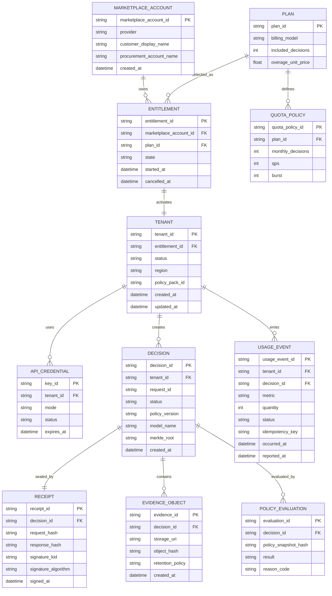

---

## 9. Estado do entitlement / tenant

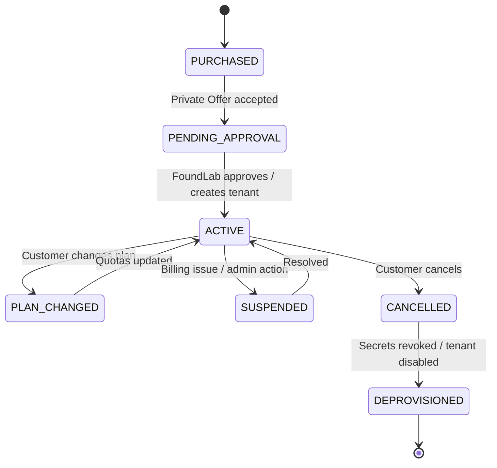

---

## 10. Pricing / packaging

### 10.1 MVP Private Offer

```txt
SKU: REX Guard Private Pilot
Billing: flat monthly
Range: USD 5k–15k/month
Included: X billable_decisions/month
Overage: manual/report-only in MVP
Support: business-hours + incident escalation
```

### 10.2 v2 Integrated SaaS

```txt
Starter:
  base: USD 499/month
  included: 100k decisions
  overage: USD 0.006/decision

Pro:
  base: USD 2,500/month
  included: 1M decisions
  overage: USD 0.003/decision

Enterprise:
  private offer
  custom SLA
  mTLS
  dedicated key ring / regional data controls
```

### 10.3 Billable metric

```json
{
  "metric": "billable_decision",
  "unit": "1 decision",
  "billable_when": "authenticated request resolves a tenant and reaches policy evaluation, returning ALLOWED, BLOCKED, WARN, or ERROR_BLOCKED",
  "not_billable_when": "unauthenticated request, malformed request before tenant resolution, duplicate idempotency key, FoundLab infrastructure outage before policy evaluation"
}
```

---

## 11. Segurança e NFRs como gates

## 11.1 Segurança

| Gate | Requisito | MVP | v2 |
|---|---|---:|---:|
| Fail-closed | erro bloqueia | obrigatório | obrigatório |
| Tenant isolation | tenant nunca acessa evidência de outro | obrigatório | obrigatório |
| No PII logs | prompt/resposta/PII fora de logs | obrigatório | obrigatório |
| KMS signing | recibo assinado | obrigatório | obrigatório |
| Secrets | Secret Manager ou equivalente | obrigatório | obrigatório |
| mTLS | Enterprise only | opcional | obrigatório para Enterprise |
| Cloud Armor/WAF | edge protection | recomendado | obrigatório |
| WIF | acesso ao projeto cliente | opcional | obrigatório quando cliente usa data plane próprio |

## 11.2 Escalabilidade

| Gate | Requisito |
|---|---|
| Cloud Run | configurar concurrency, CPU, memory, min instances por plano |
| Usage metering | fora do hot path sempre que possível |
| Ledger | idempotência por `tenant_id + request_id` |
| Burst control | quota por tenant |
| Regionality | MVP em `southamerica-east1`; v2 multi-região para Enterprise |

## 11.3 Data integrity

| Gate | Requisito |
|---|---|
| DecisionID | único e rastreável |
| Request hash | SHA-256 |
| Policy snapshot | hash versionado |
| Chain head | Spanner recomendado |
| Evidence | MVP pode manter atual; v2 migrar evidência selada para GCS Bucket Lock |
| BigQuery | analytics/reconciliação; não depender dele como única fonte WORM de origem |

## 11.4 Observabilidade

| Gate | Requisito |
|---|---|
| Trace | OpenTelemetry por gate |
| Metrics | decisões/min, blocked rate, error_blocked rate, p95/p99 |
| Cost | custo por decisão e por tenant |
| Logs | structured JSON sem PII |
| SLO | availability, latency, decision integrity |

---

## 12. Roadmap técnico

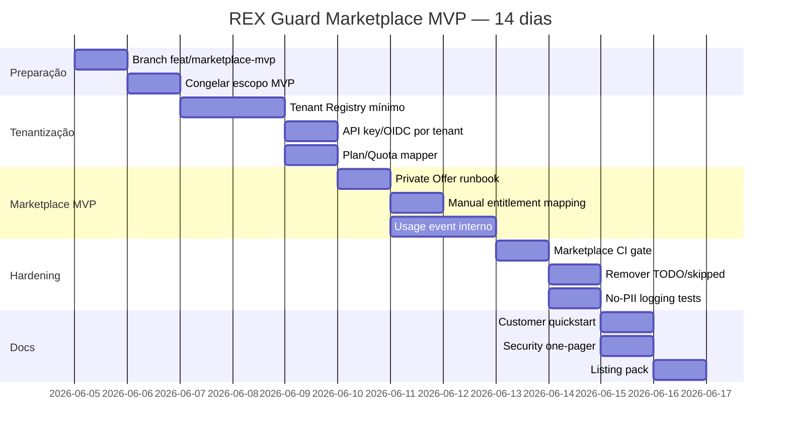

---

## 13. Tasks para Rafa

### P0 — criar branch e docs

```bash
git checkout feature/bradesco-poc
git pull
git checkout -b feat/marketplace-mvp

mkdir -p docs/marketplace
cp /tmp/REX_GUARD_MARKETPLACE_MVP.md docs/marketplace/REX_GUARD_MARKETPLACE_MVP.md
```

### P0 — adicionar scripts de CI

`package.json`:

```json
{
  "scripts": {
    "test:marketplace": "jest --coverage --runInBand --testPathIgnorePatterns=[]",
    "marketplace:check": "npm run type-check && npm run lint && npm run test:marketplace"
  }
}
```

Adicionar checagem para falhar se houver `.todo`, `.skip` ou `.only`.

Exemplo simples:

```bash
grep -R "\.todo\|\.skip\|\.only" tests src && exit 1 || exit 0
```

Sim, é tosco. Funciona. Depois refina.

### P0 — Tenant Registry mínimo

Criar:

```txt
src/marketplace/tenant-registry/tenant-types.ts
src/marketplace/tenant-registry/tenant-repository.ts
src/marketplace/tenant-registry/tenant-service.ts
```

Contrato:

```ts
export type TenantStatus = 'PENDING' | 'ACTIVE' | 'SUSPENDED' | 'CANCELLED';

export interface RexTenant {
  tenantId: string;
  marketplaceAccountId?: string;
  entitlementId?: string;
  planId: string;
  status: TenantStatus;
  region: string;
  quota: {
    monthlyBillableDecisions: number;
    qps: number;
    burst: number;
  };
  policyPackId: string;
  createdAt: string;
  updatedAt: string;
}
```

### P0 — resolver tenant no request

Em `src/routes.ts` ou middleware novo:

```txt
X-REX-Tenant → TenantRegistry.getActiveTenant()
Authorization → validar credencial
status != ACTIVE → BLOCKED / 403
quota excedida → BLOCKED / 429
```

Nunca deixar request sem tenant cair no core. Isso é fronteira comercial e fronteira de segurança.

### P0 — Usage Metering interno

Criar:

```txt
src/marketplace/usage-metering/usage-event.ts
src/marketplace/usage-metering/usage-meter.ts
```

Toda decisão que chegar no Policy Engine emite:

```txt
billable_decision = 1
```

com idempotência:

```txt
sha256(tenant_id + decision_id + metric)
```

### P1 — Entitlement service stub

Criar:

```txt
src/marketplace/entitlement-service/marketplace-event-handler.ts
src/marketplace/entitlement-service/procurement-client.ts
```

No MVP pode ser stub/manual:

```ts
export interface MarketplaceEntitlementEvent {
  eventId: string;
  eventType:
    | 'ACCOUNT_ACTIVE'
    | 'ENTITLEMENT_CREATED'
    | 'ENTITLEMENT_PLAN_CHANGED'
    | 'ENTITLEMENT_CANCELLED'
    | 'ENTITLEMENT_SUSPENDED';
  marketplaceAccountId: string;
  entitlementId: string;
  planId: string;
  occurredAt: string;
}
```

### P1 — Customer Quickstart

Criar `docs/marketplace/QUICKSTART_CUSTOMER.md`:

```md
# REX Guard Quickstart

1. Receba `tenant_id` e API key.
2. Configure endpoint REX.
3. Troque chamada direta ao Gemini por chamada ao REX.
4. Leia `decision_id` e `receipt`.
5. Use `decision_id` para auditoria.
```

---

## 14. Pull/copy map — do GCPPoC para Marketplace MVP

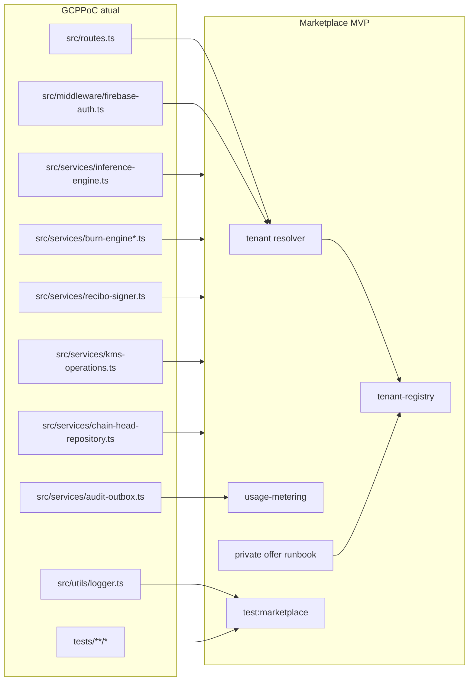

---

## 15. GitHub PR plan

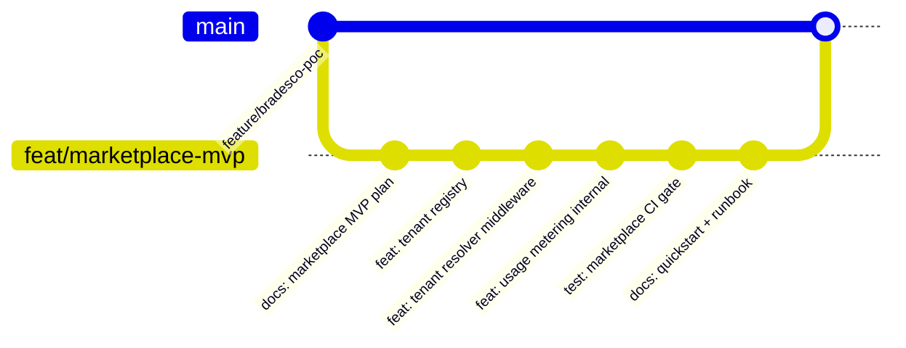

### PRs menores

| PR | Escopo | Merge gate |
|---|---|---|
| PR 1 | docs/marketplace + ADR | review Alex/Rapha |
| PR 2 | tenant registry | unit tests |
| PR 3 | tenant resolver + auth integration | integration tests |
| PR 4 | usage metering interno | idempotency tests |
| PR 5 | marketplace CI gate | 0 TODO / 0 skipped |
| PR 6 | quickstart + private offer runbook | dry run com cliente fake |

---

## 16. Marketplace readiness checklist

## 16.1 Produto

- [ ] Nome final: `REX Guard for Gemini`
- [ ] Descrição curta
- [ ] Descrição longa
- [ ] Categoria: AI Governance / Security / Compliance
- [ ] Screenshot/demo flow
- [ ] Pricing MVP Private Offer
- [ ] Support policy
- [ ] Terms
- [ ] Privacy
- [ ] Security one-pager
- [ ] Architecture one-pager

## 16.2 Técnico MVP

- [ ] Cloud Run service saudável: `rex-guard`
- [ ] Artifact Registry push OK
- [ ] `test:marketplace` verde
- [ ] 0 `todo`
- [ ] 0 `.skip`
- [ ] 0 `.only`
- [ ] no PII logs testado
- [ ] tenant required em rotas sensíveis
- [ ] usage event emitido
- [ ] receipt assinado
- [ ] evidence registrada
- [ ] fail-closed testado

## 16.3 Técnico v2

- [ ] Partner Procurement API
- [ ] Pub/Sub entitlement topic
- [ ] Entitlement state machine
- [ ] Service Control usage reporting
- [ ] Reconciliation job
- [ ] Plan change
- [ ] Suspension
- [ ] Cancellation
- [ ] Customer onboarding page
- [ ] JWT verification no signup flow

---

## 17. Runbook MVP — primeira venda via Marketplace

### 17.1 Antes da venda

```bash
npm run marketplace:check
gcloud run services describe rex-guard --region=southamerica-east1 --project=foundlab-ati
gcloud logging read 'resource.type="cloud_run_revision" AND severity>=ERROR' --limit=20
```

### 17.2 Criar tenant

```bash
# pseudo-comando até existir CLI real
node scripts/create-tenant.js \
  --tenant-id ten_customer_001 \
  --plan rex_guard_private_pilot \
  --region southamerica-east1 \
  --monthly-decisions 1000000 \
  --qps 20
```

### 17.3 Gerar credencial

```bash
node scripts/issue-api-key.js \
  --tenant-id ten_customer_001 \
  --expires-in-days 90
```

### 17.4 Teste de smoke

```bash
curl -X POST "https://<rex-endpoint>/v1/gemini:generateContent" \
  -H "Authorization: Bearer <TOKEN>" \
  -H "X-REX-Tenant: ten_customer_001" \
  -H "X-REX-Request-ID: req_smoke_001" \
  -H "Content-Type: application/json" \
  -d @examples/smoke-request.json
```

### 17.5 Critério de aceite

Resposta precisa conter:

```txt
decision_id
status
receipt.request_hash
receipt.signature_algorithm
billing.metric = billable_decision
```

---

## 18. Riscos e mitigação

| Risco | Impacto | Mitigação |
|---|---:|---|
| Vender como self-service completo antes da hora | Alto | chamar de Private Offer / Managed SaaS MVP |
| 20 testes TODO aparecerem em diligence | Médio | zerar antes do Partner Hub |
| Tenant isolation incompleta | Alto | tenant required antes de policy/inference |
| Usage billing errado | Alto | idempotency key + reconciliação |
| Logs com prompt/resposta | Crítico | testes de redaction + grep CI |
| BigQuery tratado como WORM primário | Médio | v2 mover evidence package para Bucket Lock |
| OPUS/OPIN acoplado ao produto | Médio | consent provider interface |
| Customer hardcoded / Bradesco naming | Alto | grep CI bloqueando nomes de PoC |

---

## 19. Anti-requisitos

Não fazer no MVP:

- não migrar tudo para Kubernetes;
- não criar Terraform Marketplace App agora;
- não prometer FedRAMP/SOC 2/HIPAA sem certificação formal;
- não prometer p95 <520ms publicamente sem benchmark;
- não vender Burn Engine / Veritas / AuditBox como produtos separados no v1;
- não expor PoC Bradesco no listing;
- não depender de OPUS/OPIN como requisito universal;
- não fazer usage-based billing como blocker da primeira venda.

---

## 20. Referências oficiais Google Cloud Marketplace

- SaaS products on Google Cloud Marketplace:  
  https://docs.cloud.google.com/marketplace/docs/partners/integrated-saas

- Technical integration setup:  
  https://docs.cloud.google.com/marketplace/docs/partners/integrated-saas/technical-integration-setup

- Backend integration / Partner Procurement API / Pub/Sub:  
  https://docs.cloud.google.com/marketplace/docs/partners/integrated-saas/backend-integration

- Usage reporting / Service Control:  
  https://docs.cloud.google.com/marketplace/docs/partners/integrated-saas/configure-usage-reports

- Pricing model for SaaS:  
  https://docs.cloud.google.com/marketplace/docs/partners/integrated-saas/select-pricing

- Manage entitlements:  
  https://docs.cloud.google.com/marketplace/docs/partners/integrated-saas/manage-entitlements

- Private Offer entitlements:  
  https://docs.cloud.google.com/marketplace/docs/partners/offers/manage-entitlements

---

## 21. Veritas Seal

```yaml
decision: "Build REX Guard Marketplace MVP from GCPPoC"
mode: "Private Offer / FoundLab-operated SaaS first"
backend_source:
  project: "foundlab-ati"
  region: "southamerica-east1"
  cloud_run_service: "rex-guard"
  artifact_registry: "southamerica-east1-docker.pkg.dev/foundlab-ati/rex-guard"
primary_metric: "billable_decision"
first_gate:
  - "tenant registry"
  - "tenant-required routes"
  - "usage metering internal"
  - "marketplace CI"
  - "customer quickstart"
do_not_do_yet:
  - "public self-service"
  - "full usage-based Marketplace billing"
  - "Kubernetes app packaging"
  - "component products for Burn/Veritas/AuditBox"
```