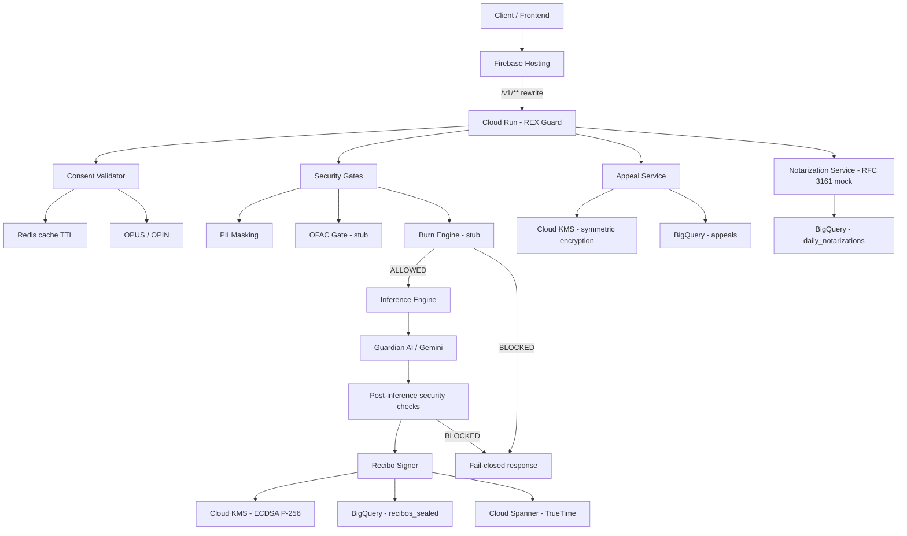

# REX Guard — Middleware de Governança, Evidência Criptográfica e Audit Trail para Inferência de IA

[](https://github.com/irelia0nerf/GCPPoCB/actions/workflows/deploy.yml)


## Resumo executivo

O **REX Guard** é a camada de governança, validação e trilha auditável ao redor da inferência de IA. Ele não é o modelo de IA em si: valida consentimento, aplica gates de segurança, encaminha a chamada para o motor de inferência, gera um **recibo criptograficamente assinável** e persiste apenas a evidência necessária para auditoria.

Neste repositório, o recorte atual é um **PoC interno voltado a Open Finance / Bradesco**, com backend em **Fastify + TypeScript**, frontend em **Next.js** exportado estaticamente para **Firebase Hosting**, e caminho ativo de entrega via **GitHub Actions -> Artifact Registry -> Cloud Run**. O projeto inclui também artefatos de Kubernetes/GKE, mas eles **não são o fluxo canônico de deploy ativo** encontrado no workflow principal.

O desenho operacional atual é: **request -> consent validation -> security gates -> Guardian AI / Gemini -> recibo assinado -> audit trail**. O projeto tenta impor comportamento **fail-closed** quando dependências críticas falham, sobretudo em validação de consentimento, assinatura KMS, auditoria e persistência.

---

## O que é o REX Guard

O REX Guard implementa três responsabilidades principais no estado atual do repositório:

- **Consent-bound inference**: cada inferência deve chegar com `consent_id` válido e escopo compatível.
- **Governança de segurança**: aplica masking de PII, OFAC gate e Burn Engine antes e depois da inferência.
- **Audit trail criptográfico**: gera um `recibo` com `prev_hash`, `decision_output_hash`, `timestamp`, `signature` ECDSA P-256, status de gates e metadados de decisão.

### O que ele não é

- Não é o modelo Gemini.
- Não é um data lake de prompts/respostas.
- Não é um sistema completo de IAM/autenticação de aplicação; no estado atual, a proteção de acesso é assumida principalmente por **Cloud Run IAM / perimeter / ingress**.
- Não é um produto final de produção já endurecido; há stubs, mocks e divergências documentais que precisam ser explicitadas.

---

## Arquitetura em alto nível

- **Frontend**: Next.js 15 com export estático para Firebase Hosting.
- **Entrada HTTP**: Firebase Hosting reescreve `/v1/**` para o serviço **Cloud Run** `rex-guard` em `southamerica-east1`.
- **Backend**: Fastify expõe `/v1/infer`, `/v1/appeal`, `/v1/admin/notarize-day` e endpoints de health.
- **Consentimento**: `ConsentValidator` consulta OPUS/OPIN e usa Redis para cache TTL.
- **Segurança**: `SecurityGates` aplica masking de CPF/CNPJ e faz checagens simples de OFAC/Burn Engine.
- **Inferência**: `InferenceEngine` chama o endpoint de Guardian AI / Gemini.
- **Evidência**: `ReciboSigner` gera hashes, assina via Cloud KMS ECDSA P-256 e persiste em BigQuery.
- **Tempo autoritativo**: `Spanner CURRENT_TIMESTAMP()` é usado como timestamp de attestation.
- **Contestação**: `AppealService` cifra o motivo via KMS e registra em BigQuery.
- **Notarização diária**: `NotarizationService` registra a cabeça da cadeia diária; hoje usa mock RFC 3161.

---

## Fluxo operacional



---

## Principais capacidades

- **Validação de consentimento por `consent_id`** com checagem de status e escopo.
- **Cache Redis de consentimento** com TTL configurável (`CONSENT_CACHE_TTL`, padrão 60s).
- **Masking de CPF/CNPJ** na camada de segurança.
- **Gates pré e pós-inferência** para bloquear payloads/saídas inadequadas.
- **Assinatura ECDSA P-256 via Cloud KMS** com conversão DER -> raw `(r||s)`.
- **Audit trail append-only em BigQuery** com `prev_hash` e `decision_output_hash`.
- **Timestamp autoritativo via Cloud Spanner** para evitar relógio local como fonte de attestation.
- **Fluxo de contestação (`/v1/appeal`)** com cifragem do campo sensível antes da persistência.
- **Health probes** para liveness, readiness e estado agregado de dependências.
- **Utilitários de secure memory** para zeroing de buffers e limpeza de objetos sensíveis.

---

## Estrutura do repositório

```text
.
├── src/
│   ├── index.ts                  # Entrypoint Fastify e registro das rotas
│   ├── health.ts                 # /health, /health/live, /health/ready
│   ├── shutdown.ts               # Graceful shutdown e fechamento de Redis
│   ├── services/
│   │   ├── appeal-service.ts     # Contestação de decisão com cifragem KMS
│   │   ├── consent-validator.ts  # Validação OPUS/OPIN + cache Redis
│   │   ├── inference-engine.ts   # Orquestração principal da inferência
│   │   ├── kms-operations.ts     # Assinatura KMS e destroy de key version
│   │   ├── notarization-service.ts
│   │   ├── recibo-signer.ts      # Construção e persistência do recibo
│   │   ├── redis-client.ts       # Cliente singleton ioredis
│   │   ├── security-gates.ts     # PII masking, OFAC gate e Burn Engine
│   │   └── spanner-timestamp.ts  # TrueTime via Spanner
│   ├── types/
│   └── utils/
├── frontend/
│   ├── app/                      # App Router + layout + page
│   ├── components/               # UI do chat, attestation e appeal
│   ├── types/                    # Tipos de API e cenários da UI
│   └── next.config.ts            # output: export
├── tests/
│   ├── unit/                     # Testes unitários
│   ├── integration/              # Fluxos integrados em memória/local
│   ├── integration-gcp/          # Testes contra dependências GCP reais
│   └── setup.ts                  # Setup de Jest
├── .github/workflows/            # CI/CD e testes GCP
├── infra/
│   ├── docker/                   # Dockerfile multi-stage
│   └── gcloud/                   # Scripts auxiliares de setup/deploy
├── k8s/                          # Manifests de Kubernetes/GKE (não canônicos hoje)
├── scripts/                      # Smoke, validate e deploy GKE
├── docs/                         # Deploy, compliance, testes e operação
├── firebase.json                 # Rewrite Hosting -> Cloud Run
├── docker-compose.yml            # Redis local + app
└── package.json                  # Scripts e dependências do backend
```

---

## Pré-requisitos

### Backend

- **Node.js**
  - **CI:** Node 22
  - **runtime mínimo aceito:** `>=20`
  - **imagem Docker atual:** Node 20
- `npm`
- Docker (opcional, mas útil para validação e `docker-compose`)
- Redis local, caso queira reproduzir cache sem Memorystore
- `gcloud` autenticado, caso vá testar contra GCP real

### Frontend

- Node.js compatível com Next.js 15
- `npm`

### Dependências GCP para fluxo real

- Cloud Run
- Artifact Registry
- Cloud KMS
- BigQuery
- Cloud Spanner
- Memorystore / Redis
- Firebase Hosting

---

## Setup local

### 1) Backend

```bash
npm ci
cp .env.example .env
npm run dev
```

Servidor padrão: `http://localhost:8080`

### 2) Redis local

Opção com Docker Compose:

```bash
docker-compose up -d redis
```

Ou stack completa:

```bash
docker-compose up --build
```

### 3) Frontend

```bash
cd frontend
npm ci
npm run dev
```

Frontend padrão: `http://localhost:3000`

### 4) Build estático do frontend

```bash
cd frontend
npm run build
```

O output final é exportado para `frontend/out`, compatível com o `firebase.json`.

### 5) Observações importantes para execução local

- Sem GCP configurado, o backend pode bloquear corretamente fluxos que dependem de KMS, BigQuery, Spanner ou Guardian AI.
- O projeto foi desenhado para **falhar fechado** em partes críticas; portanto, erro local sem dependências reais nem sempre significa bug.
- O arquivo `.env.example` **não contém todas as variáveis usadas em deploy**, especialmente as ligadas a appeal e alguns segredos operacionais.

---

## Scripts principais

| Script | Escopo | Descrição |
|---|---|---|
| `npm run build` | backend | Compila TypeScript para `dist/` |
| `npm run start` | backend | Inicia `dist/index.js` com `--expose-gc` |
| `npm run dev` | backend | Roda o backend com `ts-node` |
| `npm run test` | backend | Executa Jest |
| `npm run test:unit` | backend | Executa a suíte unitária |
| `npm run test:integration` | backend | Executa testes de integração locais |
| `npm run test:ci` | backend | Executa suíte com coverage em modo CI |
| `npm run test:memory` | backend | Foca nos testes de zero-persistence |
| `npm run test:e2e` | backend | Executa suíte e2e por padrão do projeto |
| `npm run test:gcp` | backend | Executa testes com dependências GCP reais |
| `npm run type-check` | backend | Verifica tipos TypeScript sem emitir artefatos |
| `npm run lint` | backend | Lint de `src/` e `tests/` |
| `npm run validate` | backend | `type-check + lint + test:unit` |
| `npm run clean` | backend | Remove `dist/` |
| `npm run dev` | frontend | Inicia o frontend Next.js |
| `npm run build` | frontend | Gera build/export estático |
| `npm run start` | frontend | Inicia Next.js em modo servidor |
| `npm run lint` | frontend | Lint do frontend |

---

## Variáveis de ambiente

| Variável | Obrigatória | Exemplo | Finalidade |
|---|---|---|---|
| `GOOGLE_CLOUD_PROJECT` | sim | `foundlab-ati-bradesco-sandbox` | Projeto GCP principal |
| `KMS_KEY_RESOURCE` | sim | `projects/.../cryptoKeyVersions/1` | Chave ECDSA P-256 usada para assinar recibos |
| `KMS_APPEAL_KEY_RESOURCE` | sim para appeals | `projects/.../cryptoKeyVersions/1` | Chave de cifragem do motivo de contestação |
| `KMS_LOCATION` | não | `global` | Localização do key ring |
| `KMS_KEY_RING` | não | `rex-guard` | Key ring do KMS |
| `KMS_KEY_NAME` | não | `envelope-key` | Nome lógico da chave de assinatura |
| `BQ_DATASET` | sim | `audit_trail` | Dataset do audit trail |
| `BQ_TABLE` | sim | `recibos_sealed` | Tabela principal de recibos |
| `SPANNER_INSTANCE` | sim em fluxo real | `rex-guard-spanner` | Instância do Spanner |
| `SPANNER_DATABASE` | sim em fluxo real | `audit` | Banco usado para `CURRENT_TIMESTAMP()` |
| `REDIS_HOST` | sim | `10.0.0.10` ou `localhost` | Host do Redis / Memorystore |
| `REDIS_PORT` | não | `6379` | Porta do Redis |
| `REDIS_PASSWORD` | não | `***` | Senha do Redis, quando aplicável |
| `REDIS_TLS` | não | `true` | Habilita TLS no Redis |
| `REDIS_DB` | não | `0` | DB lógico do Redis |
| `REDIS_KEY_PREFIX` | não | `rex:` | Prefixo de chaves no cache |
| `OPUS_BASE_URL` | sim para validação real | `https://opus.bcb.gov.br` | Base URL do OPUS/OPIN |
| `CONSENT_CACHE_TTL` | não | `60` | TTL do cache de consentimento |
| `GUARDIAN_AI_URL` | sim para inferência real | `http://guardian-ai:8080` | Endpoint do motor de inferência |
| `GEMINI_MODEL_ID` | não | `gemini-3-flash` | ID lógico do modelo |
| `GEMINI_MODEL_VERSION` | não | `2026-04-10T16:51:00Z` | Versão/identificador do modelo |
| `PORT` | não | `8080` | Porta do servidor HTTP |
| `NODE_ENV` | não | `production` | Ambiente de execução |
| `LOG_LEVEL` | não | `info` | Nível de log do pino |
| `SERVICE_NAME` | não | `rex-guard` | Nome lógico do serviço |

---

## API

### `POST /v1/infer`

Executa a pipeline principal: valida consentimento, aplica gates, chama Guardian AI / Gemini, tenta selar o recibo e responde com `ALLOWED` ou `BLOCKED`.

#### Exemplo de request

```json
{
  "user_id": "USER:alex-bradesco",
  "consent_id": "OPER:550e8400:2026-04",
  "payload_type": "INVESTMENT_RECOMMENDATION",
  "payload": {
    "text": "Analise o risco desta transação Pix de alto valor fora do padrão histórico do cliente."
  }
}
```

#### Exemplo de resposta `ALLOWED`

```json
{
  "status": "ALLOWED",
  "recibo_id": "3f9baf0c-1b8d-4f8c-a8d1-2e1bc0c9a901",
  "user_readable_summary": "Sua solicitação foi aprovada pelo sistema de IA (...)",
  "timestamp": "2026-04-11T07:30:45.123456Z"
}
```

#### Exemplo de resposta `BLOCKED`

```json
{
  "status": "BLOCKED",
  "reason": "CONSENT_REVOKED"
}
```

#### Possíveis razões de bloqueio

- `CONSENT_NOT_FOUND`
- `CONSENT_REVOKED`
- `CONSENT_EXPIRED`
- `SCOPE_MISMATCH`
- `INFERENCE_FAILED`
- `OFAC_BLOCK`
- `BURN_ENGINE_BLOCK`
- `AUDIT_TRAIL_FAILED`
- `INTERNAL_ERROR`

### `POST /v1/appeal`

Registra contestação de uma decisão. O campo sensível (`reason`) é cifrado antes da persistência.

#### Exemplo de request

```json
{
  "recibo_id": "3f9baf0c-1b8d-4f8c-a8d1-2e1bc0c9a901",
  "reason": "Solicito revisão humana da decisão.",
  "user_id": "USER:alex-bradesco"
}
```

#### Exemplo de resposta

```json
{
  "status": "APPEAL_REGISTERED",
  "message": "A sua contestação foi registada e será analisada por um humano.",
  "appeal_id": "6c6d7f2e-a6a8-46af-9c5f-ae8f1b4d0c42",
  "recibo_id": "3f9baf0c-1b8d-4f8c-a8d1-2e1bc0c9a901",
  "timestamp": "2026-04-11T07:35:10.102300Z"
}
```

### `POST /v1/admin/notarize-day`

Notariza a cabeça atual da cadeia diária. No estado atual do repositório, o token TSA é **mock**.

#### Exemplo de resposta

```json
{
  "date": "2026-04-11",
  "merkle_root_hash": "...",
  "tsa_token": "...",
  "tsa_status": "SUCCESS",
  "timestamp": "2026-04-11T23:59:59.000000Z"
}
```

### Health endpoints

#### `GET /health/live`

```json
{ "status": "alive" }
```

#### `GET /health/ready`

Retorna `200` quando KMS, BigQuery e Redis estão alcançáveis; caso contrário, `503` com detalhes de dependências.

#### `GET /health`

Retorna estado agregado (`healthy` ou `degraded`) e indicadores resumidos de dependências.

---

## Testes e qualidade

O repositório contém suites em três camadas:

- **Unitários** em `tests/unit/`
- **Integração local** em `tests/integration/`
- **Integração GCP** em `tests/integration-gcp/`

Os alvos cobertos incluem:

- `recibo-signer`
- `kms-operations`
- `secure-memory`
- `security-gates`
- `appeal-service`
- `notarization-service`
- `consent-validator`
- fluxo completo de inferência
- Merkle chain
- zero-persistence
- Spanner/KMS/Redis/Notarization em GCP real

### Observações de qualidade

- O workflow principal roda **type-check + suíte completa com coverage**.
- Há documentação e logs antigos citando números específicos de testes e cobertura; o `README` canônico evita repetir contagens não reconciliadas entre arquivos.
- Existe pelo menos um drift conhecido em tooling/documentação de teste, inclusive warnings antigos de configuração do Jest em material arquivado.

---

## CI/CD e deploy

### Fluxo ativo encontrado no repositório

1. GitHub Actions executa testes e type-check.
2. Autentica no GCP via **OIDC** (`google-github-actions/auth@v2`).
3. Faz build da imagem com `infra/docker/Dockerfile`.
4. Envia a imagem para **Artifact Registry**.
5. Faz deploy do serviço **Cloud Run** `rex-guard` em `southamerica-east1`.
6. O frontend estático é servido pelo **Firebase Hosting**, que reescreve `/v1/**` para esse serviço.

### Artefatos adicionais presentes

- `k8s/` contém manifests de Kubernetes/GKE.
- `scripts/gke-deploy.sh` implementa um caminho alternativo voltado a GKE.
- Esses artefatos existem e são úteis para evolução, mas **não substituem o fato de que o workflow ativo principal hoje entrega Cloud Run**.

### Autenticação e perimeter

O deploy para Cloud Run usa `--no-allow-unauthenticated`, indicando que o acesso é pensado para ocorrer com **IAM/ingress controlado**. No entanto, o backend Fastify **não implementa validação explícita de bearer token nas rotas** neste estado do código.

Isso significa que a proteção de acesso atual está ancorada principalmente em:

- Cloud Run IAM
- configuração de ingress/perímetro
- eventualmente Firebase/infra de borda

Não trate o backend, isoladamente, como se já possuísse enforcement completo de auth em nível de aplicação.

---

## Segurança e compliance

### Controles implementados no repositório

- **Fail-closed** quando consentimento, inferência ou auditoria crítica falham.
- **PII redaction** no logger via `pino.redact`.
- **Masking de CPF/CNPJ** em texto pela `SecurityGates`.
- **Assinatura ECDSA P-256 via Cloud KMS**.
- **Conversão DER -> raw `(r||s)`** para preservar invariante de assinatura compacta.
- **Timestamp autoritativo via Spanner** em vez de confiar em relógio local para o campo principal do recibo.
- **`prev_hash` + `decision_output_hash`** formando encadeamento verificável.
- **Contestação cifrada via KMS** antes de BigQuery.
- **Secure memory helpers** (`shredBuffer`, `clearObjectStrings`, `requestGC`).
- **Health/readiness** verificando alcance de KMS, BigQuery e Redis.

### Postura de compliance refletida nos docs

A documentação do repositório tenta alinhar o projeto a:

- BCB 538/2025
- LGPD
- EU AI Act

Mas isso deve ser lido com precisão:

- há partes **implementadas**,
- partes **parciais**,
- e partes **planejadas** para staging/produção.

O `README` canônico não trata o projeto como “compliance resolvido”; trata como um PoC com fundamentos técnicos relevantes e gaps ainda explícitos.

---

## Limitações / gaps conhecidos

Esta seção é deliberadamente objetiva. O projeto perde credibilidade se isso for escondido.

- **OFAC gate é stub**: hoje a checagem é baseada em keywords em `security-gates.ts`.
- **Burn Engine é stub**: hoje o bloqueio também é baseado em keywords e heurística simples.
- **Notarização RFC 3161 é mock**: `NotarizationService` ainda simula o token TSA.
- **Auth em nível de aplicação não está implementada**: o código depende de Cloud Run IAM/infra, não de middleware próprio para bearer token.
- **Divergência de versões Node**: CI em Node 22, runtime aceito `>=20`, Dockerfile em Node 20.
- **Divergência de runtime/deploy**: workflow principal usa Cloud Run em `southamerica-east1`, enquanto scripts/manifests GKE usam `us-central1` e fluxo alternativo.
- **Divergência de projetos/configs**: `.firebaserc` aponta `foundlab-ati`, enquanto o workflow usa `foundlab-ati-bradesco-sandbox`.
- **`local-smoke.sh` está desalinhado com o código atual**: espera `401` sem token e `status=ok` em health, mas a aplicação atual responde `alive` / `healthy` / `degraded` e delega auth à infra.
- **Dois READMEs antigos coexistem** no repositório e contam histórias incompatíveis entre si.
- **Frontend ainda contém identificadores hardcoded** (`USER_ID` e `CONSENT_ID`) em `frontend/app/page.tsx`.
- **Cache de consentimento possui janela de race documentada**: revogações podem levar até o TTL do cache para refletirem plenamente.
- **`.env.example` não expõe todas as variáveis realmente usadas no deploy**, especialmente as ligadas a appeals e segredos operacionais.
- **Health check do workflow pode entrar em conflito com `--no-allow-unauthenticated`**, já que o passo de verificação usa `curl` sem autenticação explícita.
- **`KMSOperations.destroyKeyVersion()` agenda destroy da key version após o seal**, o que é uma decisão agressiva e exige governança operacional muito clara para não colidir com rotação/continuidade.

---

## Roadmap imediato

Com base no estado atual do repositório e nos documentos operacionais, os próximos passos razoáveis são:

- substituir **OFAC gate** por integração/verificação real;
- substituir **Burn Engine stub** por política executável com regras auditáveis;
- trocar o **mock RFC 3161** por TSA real;
- alinhar **Node CI/runtime/Docker**;
- consolidar **Cloud Run vs GKE** em uma narrativa operacional única;
- corrigir **scripts/documentação desalinhados** (`local-smoke.sh`, READMEs, health expectations);
- remover **identificadores hardcoded do frontend** e acoplar identidade/autorização reais;
- revisar o passo de **health verification do deploy** para ambiente com autenticação efetivamente exigida.

---

## Notas de operação

- O backend foi escrito para iniciar com `node --expose-gc`, pois parte dos utilitários de memória depende de `global.gc()` quando disponível.
- `ReciboSigner.getLatestHash()` consulta BigQuery dentro de uma janela de lookback; isso mantém a cadeia no PoC, mas já está documentado no próprio código como algo a endurecer no futuro.
- O timestamp do recibo é o `spanner_timestamp`, não o `seal_timestamp`. O primeiro é a referência autoritativa da decisão; o segundo é só o momento local de selagem.
- O logger evita campos PII conhecidos, mas isso **não** substitui disciplina de logging nos pontos de chamada.
- O frontend usa `output: 'export'`, então a estratégia de publicação é estática, com backend desacoplado por rewrite.

---

## Licença / uso interno

Este repositório está marcado como:

- `private: true`
- `license: UNLICENSED`

Portanto, o conteúdo deve ser tratado como **uso interno / controlado**, salvo deliberação institucional em contrário.
